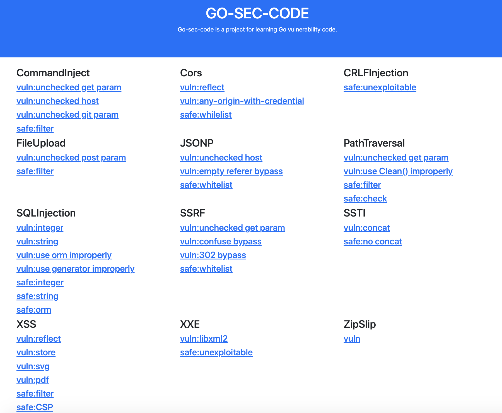

<h1 align="center">Welcome to go-sec-code 👋</h1>
<p>
</p>

> Go-sec-code is a  project for learning Go vulnerability code.

### 🏠 [Homepage](https://github.com/cokeBeer/go-sec-code)
- [Introduction](#introduction)
- [Install](#install)
- [漏洞说明](#漏洞说明)
  - [SSTI](#ssti)
  - [XXE](#xxe)
  - [SSRF](#ssrf)
  - [Path Traversal](#path-traversal)
## Introduction

用beego作为后端框架开发的go语言靶场，目前已经完成

- commandInject
  - GET参数注入
  - Host头注入
  - git参数注入
  - 安全代码
- Cors
  - 反射型Cors
  -  any-origin-with-credential
  - 安全代码
- CRLFInjection
  - 安全代码
- FileUpload
  - 利用POST参数任意目录写文件
  - 安全代码
- JSONP
  - 无防护
  - 空Referer绕过
  - 安全代码
- PathTraversal
  - 无防护
  - 错误使用Clean()
  - 安全代码（过滤）
  - 安全代码（前缀检查）
- SQLInjection
  - 数字型注入
  - 字符型注入
  - 错误的ORM使用
  - 错误的SQL生成器使用
  - 数字型安全代码
  - 字符型安全代码
  - ORM安全代码
- SSRF
  - 无防护
  - 混淆绕过
  - 302绕过
  - 安全代码（白名单）
- SSTI
  - 漏洞代码
  - 安全代码
- XSS
  - 反射型xss
  - 存储型xss
  - SVG型xss
  - PDF型xss
  - 基于过滤的修复
  - 基于CSP的修复
- XXE
  - 漏洞代码
  - 安全代码
- ZipSlip
  - 漏洞代码


## Install

运行需要安装beego和bee

参考:[beego和bee安装](https://github.com/beego/beedoc/blob/master/zh-CN/quickstart.md)

然后执行

```
git clone https://github.com/cokeBeer/go-sec-code
cd go-sec-code
bee run
```

服务器就运行在http://localhost:233 上了



为了测试SQLInjection，需要连接数据库。这里使用mysql，先执行下面的语句创建数据库和表

```sql
create database goseccode;
create table user(
	id int,
	username varchar(40),
	password varchar(40),
);
insert into user values(1,"admin","admin@123");
insert into user values(2,"test","test@123");
```

然后找到sqlinjection.go，修改source变量的值

```go
source := "username:password@tcp(127.0.0.1:3306)/goseccode"
```

即可连接数据库
## 漏洞说明

### SSTI
go语言本身提供的模版引擎仅支持简单的渲染功能，不像php、java、python 的模版引擎支持多种功能。这里在设计漏洞代码的时候找到了一个go 语言模版引擎常用的增强库[sprig](https://github.com/Masterminds/sprig)，有2.9k个star。这个增强库提供了一些常用的模版函数，其中`env`这个方法可以用来读取环境变量，能造成信息泄露。其他函数经检查，都较为安全。

### XXE

go语言本身提供的xml解析库直接忽略了xml文档中的entity和dtd标签。这里在设计漏洞代码的时候找到了一个go语言实现的libxml2库[libxml2](https://github.com/lestrrat-go/libxml2)，有193个star。这个增强库可以设置支持entity。其他go语言实现的xml库大多不支持entity和dtd标签，或者是直接封装了go语言本身提供的xml库。

### SSRF

SSRF提供了三种漏洞情形，一种安全情形。其中第二种漏洞情形用来表示黑名单不完善的情况，第三种漏洞情形来表示黑名单较为完善的情况。黑名单一般要用到字符串比较函数来实现。go语言中进行字符串比较的函数主要是`strings.HasSuffix`。这个函数在比较时不考虑大小写，如果直接使用这个函数进行比较，会导致大小写绕过。更安全的写法是使用`strings.ToLower`先将域名统一转换为小写再进行比较。

### Path Traversal

go语言提供了`filepath.Clean()`方法来规范化路径。但是这个方法不会规范没有以`/`开头的相对路径，例如`../../secret`。简单地使用`filepath.Clean()`方法来规范化路径会导致路径变遍历。比较安全的写法是使用`filepath.Join()`将指定目录（例如`static/`）与传入的参数进行拼接，然后使用`strings.HasPrefix()`方法来检查是否发生了目录穿越